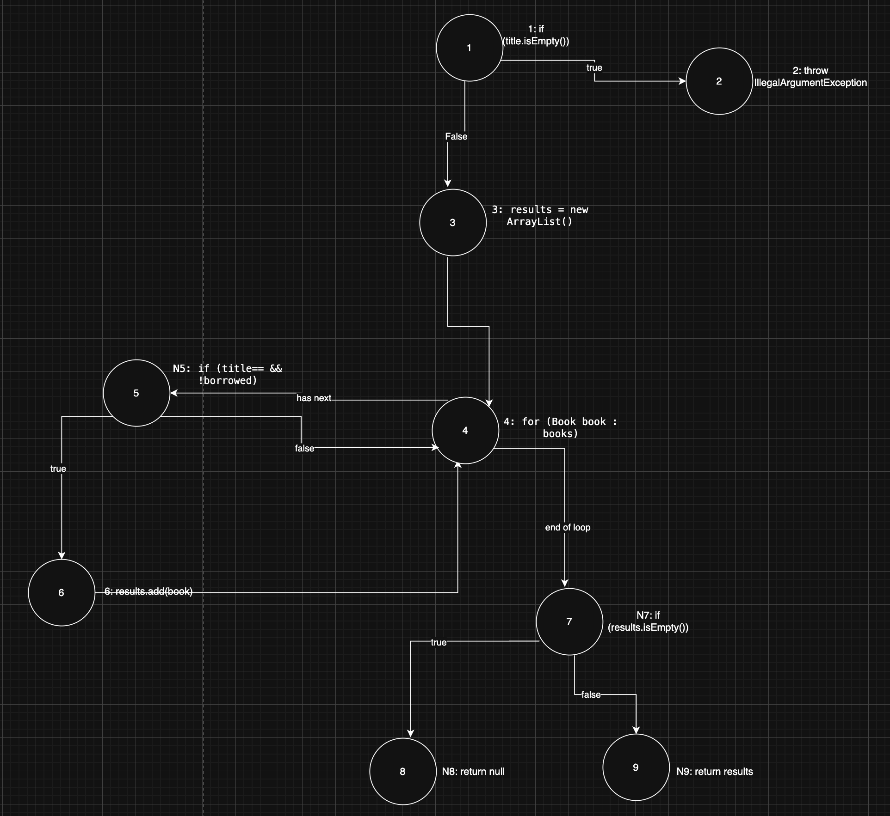
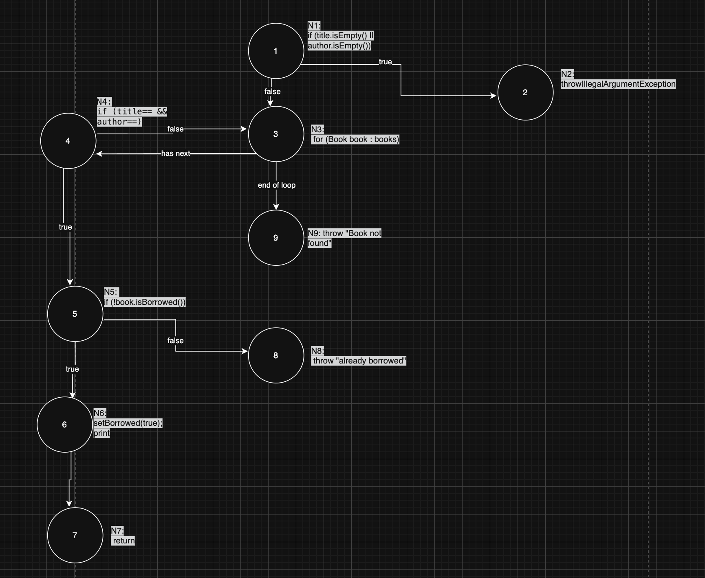

# Втора лабораториска вежба по Софтверско инженерство
Матеј Мачевски 223191

### Control Flow Graph

**searchBookByTitle**

**borrowBook**

### Цикломатска комплексност

Цикломатската комплексност за searchBookByTitle е 5.
го добив резултатот со формулата V(G) = P+1, каде P е бројот на предикатни јазли во графот. Предикатни јазли се оние јазли кои имаат повеќе од една излезна гранка, односно јазлите каде има if или for. Во оваа функција предикатни јазли се: јазол 1 (if title.isEmpty()), јазол 4 (for јамката), јазол 5 (if title== && !borrowed) и јазол 7 (if results.isEmpty()).
Бројот на предикатни јазли е P=4, па M = 4+1 = 5.

Цикломатската комплексност за borrowBook исто така е 5. Со истата формула V(G) = P+1, предикатните јазли во оваа функција се: јазол 1 (if title.isEmpty() || author.isEmpty()), јазол 3 (for-от), јазол 4 (if title== && author==) и јазол 5 (if !isBorrowed()). Бројот на предикатни јазли е P=4, па M = 4+1 = 5.

### Тест случаи според критериумот Every Statement

Критериумот Every Statement бара секоја линија од кодот да биде извршена барем еднаш низ сите тест случаи.

| | Тест 1 | Тест 2 | Тест 3 | Тест 4 |
|---|:---:|:---:|:---:|:---:|
| `if (title.isEmpty())` | * | * | * | * |
| `throw IllegalArgumentException` | * | | | |
| `results = new ArrayList()` | | * | * | * |
| `for (Book book : books)` | | * | * | * |
| `if (title== && !borrowed)` | | * | * | * |
| `results.add(book)` | | * | | |
| `if (results.isEmpty())` | | * | * | * |
| `return null` | | | * | * |
| `return results` | | * | | |

**Тест 1** — се повикува `searchBookByTitle("")`. Бидејќи насловот е празен, функцијата фрла IllegalArgumentException. Со овој тест се покрива проверката за празен наслов и исклучокот.

**Тест 2** — се повикува `searchBookByTitle("Clean Code")`. Книгата постои и не е изнајмена, па функцијата ја наоѓа и ја додава во листата. Се покриваат: иницијализацијата на листата, јамката, условот (true гранка), додавањето и враќањето на листата.

**Тест 3** — се повикува `searchBookByTitle("Harry Potter")`. Таква книга не постои во библиотеката, па листата останува празна и функцијата враќа null. Се покрива гранката каде results.isEmpty() е true.

**Тест 4** — книгата "The Hobbit" прво се изнајмува, па потоа се пребарува. Бидејќи е изнајмена, условот во for-ot е false и не се додава во листата. Функцијата враќа null. Со овој тест се покрива false гранката на условот if (title== && !borrowed).

Минималниот број на тест случаи за да се исполни Every Statement критериумот за функцијата searchBookByTitle е **4**.

### Тест случаи според критериумот Every Branch

Критериумот Every Branch бара секоја гранка (true и false) на секој услов да биде помината барем еднаш.

| | Тест 1 | Тест 2 | Тест 3 | Тест 4 | Тест 5 |
|---|:---:|:---:|:---:|:---:|:---:|
| `title.isEmpty() = true` | * | | | | |
| `author.isEmpty() = true` | | * | | | |
| `isEmpty = false` | | | * | * | * |
| `for` — match | | | * | * | |
| `for` — end of loop | | | | | * |
| `!isBorrowed = true` | | | * | | |
| `!isBorrowed = false` | | | | * | |

**Тест 1** — се повикува `borrowBook("", "J.R.R. Tolkien")`. Насловот е празен, па веднаш се фрла IllegalArgumentException. Се покрива true гранката на title.isEmpty().

**Тест 2** — се повикува `borrowBook("The Hobbit", "")`. Авторот е празен, па се фрла IllegalArgumentException. Се покрива true гранката на author.isEmpty().

**Тест 3** — се повикува `borrowBook("The Hobbit", "J.R.R. Tolkien")`. Книгата постои и не е изнајмена, па успешно се изнајмува. Се покриваат: false гранката на првиот услов, match во јамката и true гранката на !isBorrowed().

**Тест 4** — истата книга се повикува повторно откако е веќе изнајмена. Функцијата фрла RuntimeException. Се покрива false гранката на !isBorrowed().

**Тест 5** — се повикува `borrowBook("Harry Potter", "J.K. Rowling")`. Книгата не постои, па for-ot завршува без наоѓање и се фрла RuntimeException. Се покрива гранката end of loop.

Минималниот број на тест случаи за да се исполни Every Branch критериумот за функцијата borrowBook е **5**.

### Тест случаи според критериумот Multiple Condition

 Multiple Condition бара сите можни комбинации на true/false за секој подуслов да бидат тестирани.

**searchBookByTitle** — услов: `if (book.getTitle().equalsIgnoreCase(title) && !book.isBorrowed())`

| Комбинација | titleMatch | !isBorrowed | Резултат |
|---|:---:|:---:|---|
| TT | true | true | книгата се додава |
| TF | true | false | не се додава |
| FT | false | true | не се додава |

**TT** — насловот се совпаѓа и книгата не е изнајмена. Книгата се додава во листата со резултати.

**TF** — насловот се совпаѓа но книгата е изнајмена. Книгата не се додава.

**FT** — насловот не се совпаѓа. Вториот услов не се евалуира (краток спој &&) и книгата не се додава.

Минималниот број на тест случаи за Multiple Condition критериумот кај оваа функција е **3**.

---

**borrowBook** — услов: `if (title.isEmpty() || author.isEmpty())`

| Комбинација | title.isEmpty() | author.isEmpty() | Резултат |
|---|:---:|:---:|---|
| TT | true | true | throw |
| TF | true | false | throw |
| FT | false | true | throw |
| FF | false | false | продолжува |

**TT** — и насловот и авторот се празни. Се фрла IllegalArgumentException.

**TF** — само насловот е празен. Поради || операторот, вториот услов не се евалуира и се фрла исклучок.

**FT** — само авторот е празен. Се фрла IllegalArgumentException.

**FF** — ниту насловот ниту авторот се празни. Условот е false и функцијата продолжува нормално.

Минималниот број на тест случаи за Multiple Condition критериумот кај оваа функција е **4**.
